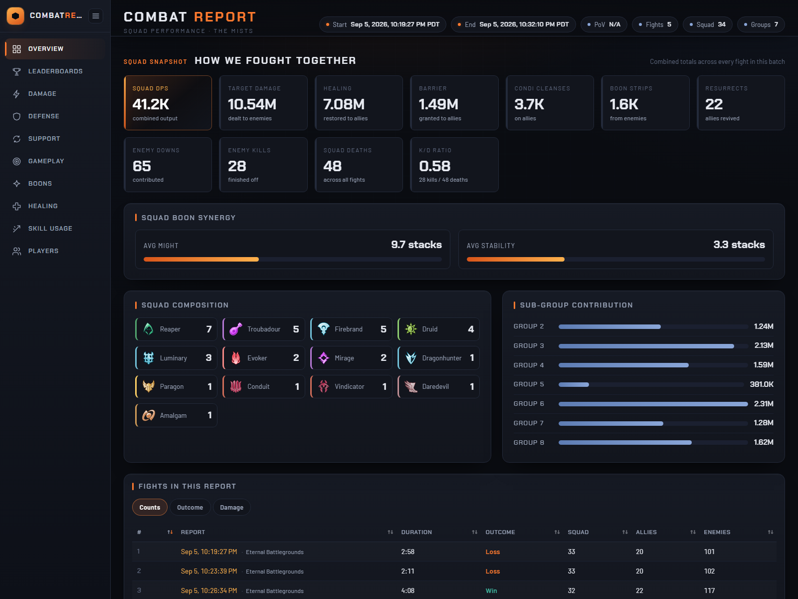
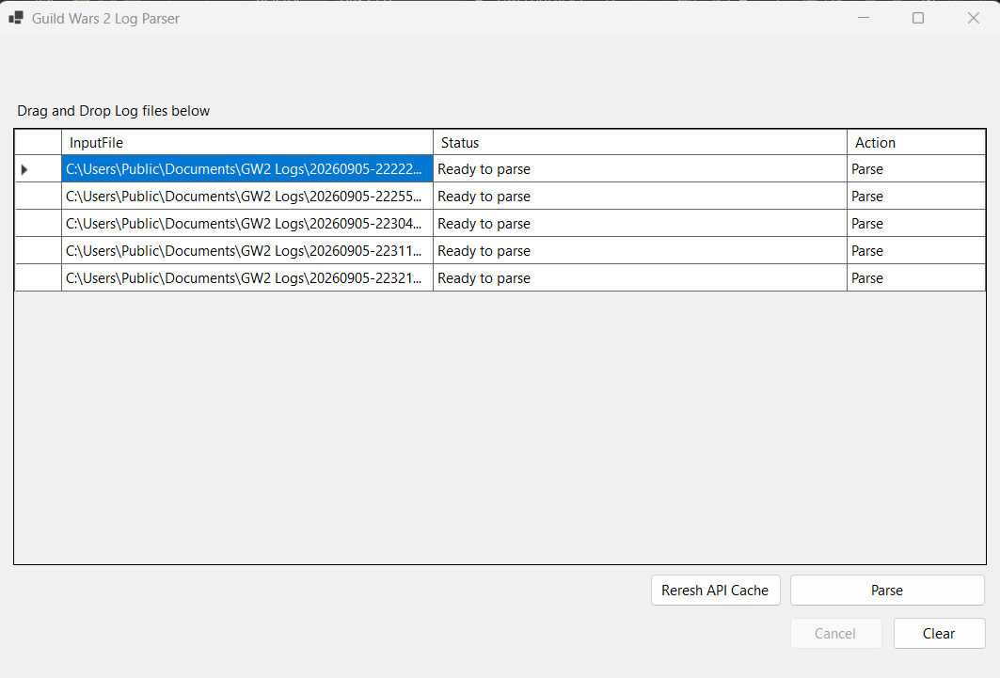
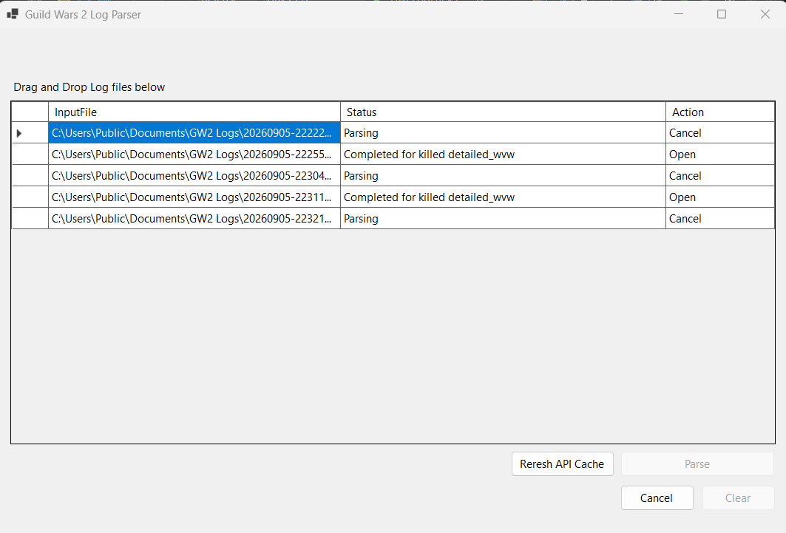
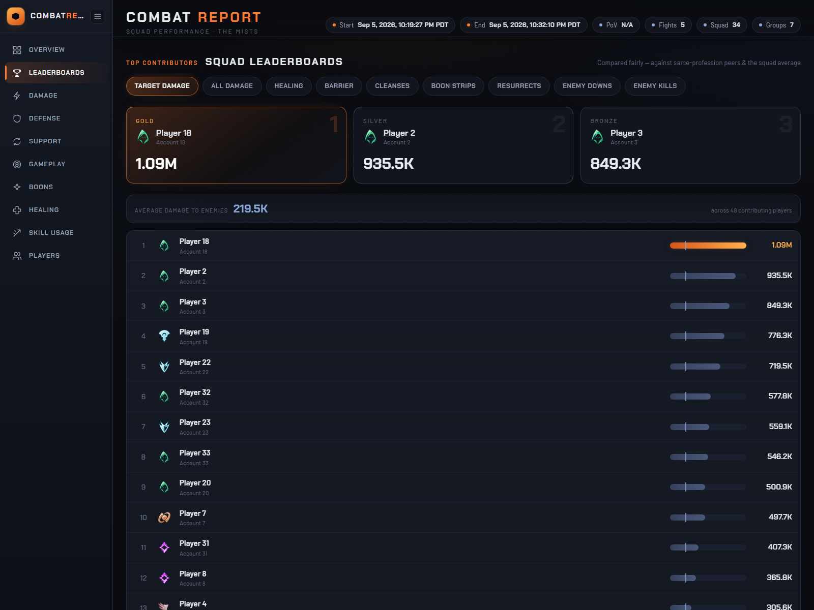
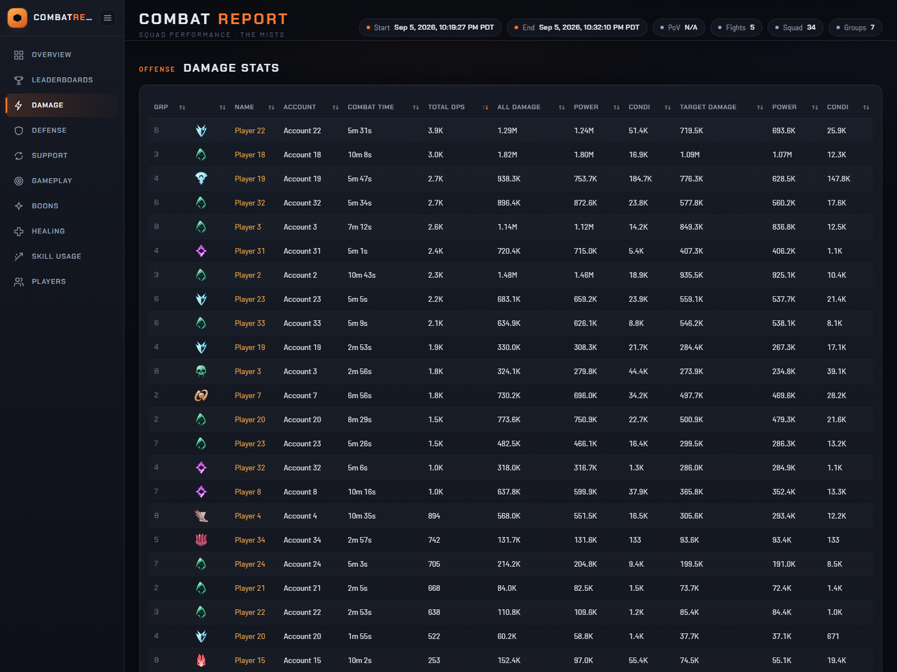
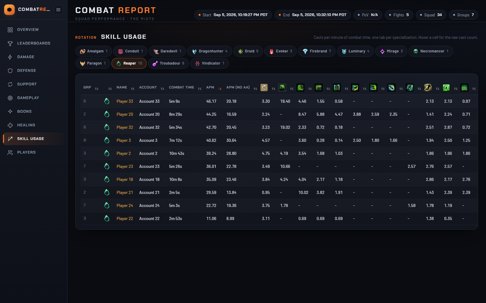

# GW2 Log Parser

GW2 Log Parser is a Windows application that takes Guild Wars 2 combat logs and converts those into a single, combined squad report that you can open in your web browser.  You still get the individual fight files as well.

If you use the arcDPS healing addon, it will use that as well.  It's recommended to use the healing addon.  Drop a set of those files into this application, click **Parse**, and it produces one page that adds all of the fights together: total damage, healing, boon uptime, downs, deaths, and more, for every member of the squad. The complete [Elite Insights](https://github.com/baaron4/GW2-Elite-Insights-Parser) report for each individual fight is generated alongside it.



All processing happens on your own computer. Your log files are never uploaded.

---

## Contents

1. [Download and installation](#download-and-installation)
2. [First launch](#first-launch)
3. [Creating a report](#creating-a-report)
4. [Understanding the report](#understanding-the-report)
5. [How long things take](#how-long-things-take)
6. [Troubleshooting](#troubleshooting)
7. [Building from source](#building-from-source)
8. [Credits](#credits)

---

## Download and installation

### Requirements

- Windows 10 or Windows 11, 64-bit.
- An internet connection. The application downloads game data from the official Guild Wars 2 API the first time it starts, and the reports it produces load supporting files from the web when opened.

### Choosing a download

Downloads are on the **[Releases page](https://github.com/aruggles/GW2LogParser/releases/latest)**. Each release offers two versions of the application. They are identical in features; the difference is only in what needs to be installed on your computer.

| File | Size | Description |
|---|---|---|
| `Gw2LogParser-<version>-win-x64-self-contained.zip` | About 72 MB | **Recommended.** Includes everything the application needs. Nothing else has to be installed. |
| `Gw2LogParser-<version>-win-x64.zip` | About 3 MB | A smaller download that requires the [.NET 8 Desktop Runtime (x64)](https://dotnet.microsoft.com/download/dotnet/8.0/runtime) to be installed on your computer first. Choose this only if you already have it, or prefer a smaller download. |

If you are unsure, choose the **self-contained** version.

A file named `SHA256SUMS.txt` is also provided on each release for those who wish to verify the integrity of their download. It is not needed to use the application.

### Installation steps

The application does not use an installer. It runs directly from a folder.

1. Download one of the zip files listed above.
2. Right-click the downloaded zip file and choose **Extract All…**. Choose any location you like, for example `C:\Games\Gw2LogParser`, and click **Extract**.
3. Open the extracted folder and double-click **`Gw2LogParser.exe`** to start the application.

**If Windows shows a blue "Windows protected your PC" message:** this appears because the application is not digitally signed, which Windows treats with caution. Click **More info**, then **Run anyway**. Windows will not ask again for the same file.

To remove the application, delete the folder you extracted it to. Nothing else is written to your system.

---

## First launch

The first time the application starts, **the window may take 10 to 20 seconds to appear.** During this time it is downloading skill, specialization, and map information from the official Guild Wars 2 API — several thousand skills in total, fetched in a series of requests. This information is what allows reports to show proper skill names and icons.

The downloaded information is saved automatically to a folder named `Content` next to `Gw2LogParser.exe`. Every launch after the first reads this saved copy instead, and the window appears in under a second. No action is needed on your part.

After a Guild Wars 2 update, new or changed skills may not yet be in your saved copy. To download a fresh copy, click the **`Reresh API Cache`** button in the lower right of the window, wait for the message "API cache has been refreshed", and click **OK**. See [Troubleshooting](#troubleshooting) for when this is useful.

---

## Creating a report

### Step 1: Locate your log files

arcDPS saves a log file for every fight it records. By default these are stored in your Documents folder at:

```
%USERPROFILE%\Documents\Guild Wars 2\addons\arcdps\arcdps.cbtlogs\
```

To open this location, copy the line above, paste it into the address bar at the top of any File Explorer window, and press Enter.

Inside you will find one folder per boss or map. Each folder contains log files named by date and time, for example `20260905-222227.zevtc`. The application accepts all three formats that arcDPS can produce: `.evtc`, `.zevtc`, and `.evtc.zip`.

### Step 2: Add the log files to the application

Select the log files you want to include in the report, then drag them from File Explorer and drop them anywhere on the large grid in the application window. Each file appears as a row with the status **Ready to parse**.



You may add as many files as you like, from any combination of folders. Files that are already listed are not added a second time.

To remove all files from the list and start over, click **Clear**.

### Step 3: Click Parse

Click the **Parse** button. The application processes up to three files at a time; the remaining files wait their turn. The **Status** column shows the progress of each file, moving from **Parsing** to **Completed**.



Processing takes a little while. As a guide, five World vs. World logs totalling about 18 MB take roughly 15 to 20 seconds on a modern desktop computer. The time depends mainly on the size of each log rather than the number of logs, so a single very large fight with many players can take longer than several small ones. The window may appear unresponsive while it is working; this is normal.

To stop processing before it finishes, click **Cancel**.

### Step 4: Open the report

When all files have finished, the report is saved **in the same folder as the log files you added**, inside a new folder named `combat_report_` followed by a long number. For example:

```
combat_report_134331526171673924\
    index.html      The combined squad report. Open this file.
    fight_1.html    The full Elite Insights report for the first fight.
    fight_2.html    The full Elite Insights report for the second fight.
    ...             One file per log.
```

Open the folder and double-click **`index.html`**. It opens in your default web browser.

Please note that the words **Parse**, **Cancel**, and **Open** shown in the application's **Action** column are status indicators only. They are not buttons and clicking them has no effect. Reports are always opened from the folder as described above.

Each time you click **Parse**, a new `combat_report_` folder is created. Earlier reports are never overwritten.

---

## Understanding the report

`index.html` is a single file containing every figure in the report. You can copy it, email it, or share it with your squad and it will display the same information for them.

The report is divided into sections, selected from the menu on the left-hand side.

| Section | What it contains |
|---|---|
| **Overview** | Squad-wide totals, average boon stacks, squad composition by profession, contribution by sub-group, and a list of every fight in the report with its duration and outcome. |
| **Leaderboards** | The top three and a full ranking of the squad for target damage, all damage, healing, barrier, condition cleanses, boon strips, resurrects, enemy downs, and enemy kills. |
| **Damage** | Damage per second, total damage, the split between power and condition damage, and damage dealt specifically to enemy players, for each squad member. |
| **Defense** | Damage taken, blocks, evades, dodges, times downed, and deaths. |
| **Support** | Condition cleanses, boon strips, and resurrects performed. |
| **Gameplay** | Actions per minute, flanking rate, critical hit rate, and average distance to the squad and to the commander. |
| **Boons** | Boon uptime, and boon generation for self, sub-group, off-group, and the whole squad. |
| **Healing** | Outgoing and incoming healing and barrier. |
| **Skill Usage** | Casts per minute for each skill, with one tab per elite specialization. |
| **Players** | An expandable card for each player with their complete individual statistics. |





<details>
<summary><b>Additional screenshot: Skill Usage</b></summary>

Casts per minute for each skill, with one tab per elite specialization:



</details>

Every table can be sorted by clicking a column heading.

The `fight_N.html` files are standard Elite Insights reports for each individual fight. They include the combat replay, skill rotations, and mechanics tracking. These files are large, typically 1 to 4 MB each, and may take a few seconds to display.

**An internet connection is required to view reports.** The pages load their layout and table components from public content delivery networks, and skill icons from ArenaNet's servers. Without a connection, the report will not display correctly.

The player names in the screenshots on this page have been anonymized. Your own reports show actual character and account names.

---

## How long things take

| Activity | Typical time |
|---|---|
| First launch | 10 to 20 seconds until the window appears |
| Every launch after the first | Under a second |
| Parsing five World vs. World logs (about 18 MB in total) | 15 to 20 seconds |
| Opening `index.html` | About one second |
| Opening an individual `fight_N.html` | A few seconds |

Timings were measured on a modern desktop computer and will vary with hardware and log size.

---

## Troubleshooting

**Nothing happens when I drop files onto the window.**
Files must be dropped onto the grid area itself, not the title bar or buttons. Only `.evtc`, `.zevtc`, and `.evtc.zip` files are accepted.

**A log shows a failure status.**
Very short fights are skipped by design, and a log that arcDPS did not finish writing, for example because the game crashed or was closed mid-fight, may be unreadable. The other files in the batch are still processed, and the combined report is built from those that succeeded.

**Skill names appear as numbers, or skill icons are missing.**
The saved API information is older than the current version of the game. Click **`Reresh API Cache`**, wait for the confirmation message, and parse the logs again.

**The application takes 10 to 20 seconds to start every time.**
The application could not save its game data next to `Gw2LogParser.exe`, usually because that folder is read-only (for example, under `C:Program Files`). Move the application to a folder you own, such as a folder in Documents, and start it again.

**There is no `index.html` in the output folder.**
The combined report is only created when at least one log was processed successfully. Check the **Status** column for each file.

**The report opens as a blank page or as unformatted text.**
The report requires an internet connection to load its supporting files. Check your connection. Some workplace networks block the content delivery networks the report uses; if so, try opening the report from another network.

**I cannot find the output folder.**
The report is saved next to the *log files*, not next to the application. Look in the folder containing the logs you added, for a folder beginning with `combat_report_`.

---

## Building from source

This section is for developers. Users of the application do not need to build it.

Requirements: Windows and the [.NET 8 SDK](https://dotnet.microsoft.com/download/dotnet/8.0).

```
git clone https://github.com/aruggles/GW2LogParser.git
cd GW2LogParser
dotnet build Gw2LogParser.sln -c Release
```

The built application is located at `bin\Release\net8-windows\Gw2LogParser.exe`.

Always build the **Release** configuration. The bundled Elite Insights parser contains debug-only assertions that abort parsing of logs produced by game builds newer than its balance data. These assertions are compiled out in Release builds.

For an overview of the project's architecture and the procedure for updating the bundled Elite Insights version, see [`CLAUDE.md`](CLAUDE.md).

---

## Credits

- **[GW2 Elite Insights Parser](https://github.com/baaron4/GW2-Elite-Insights-Parser)** by baaron4 and contributors performs all of the underlying log parsing and produces the per-fight reports. This project includes version 3.28.0.1 of the parser and adds the Windows user interface and the combined cross-fight summary.
- **[arcDPS](https://www.deltaconnected.com/arcdps/)** by deltaconnected is the addon that records the combat logs.

This project is not affiliated with or endorsed by ArenaNet. Guild Wars 2 is a trademark of ArenaNet, LLC.
